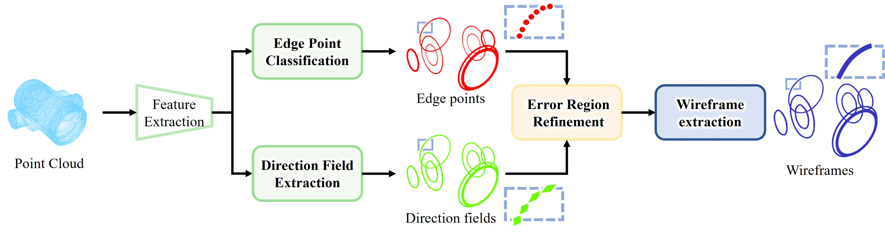
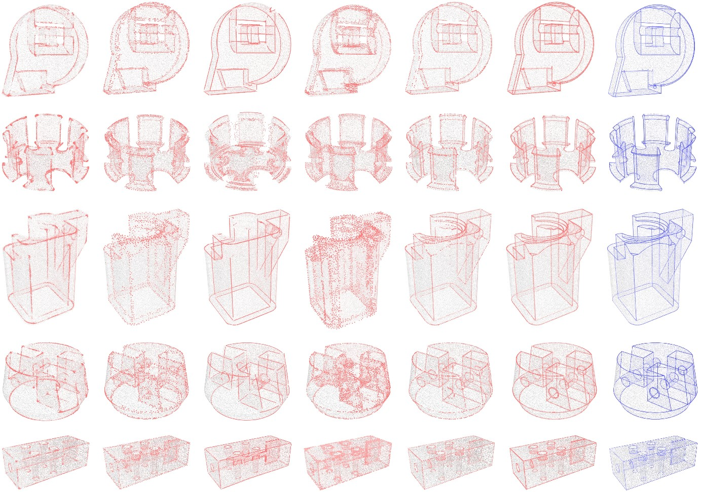
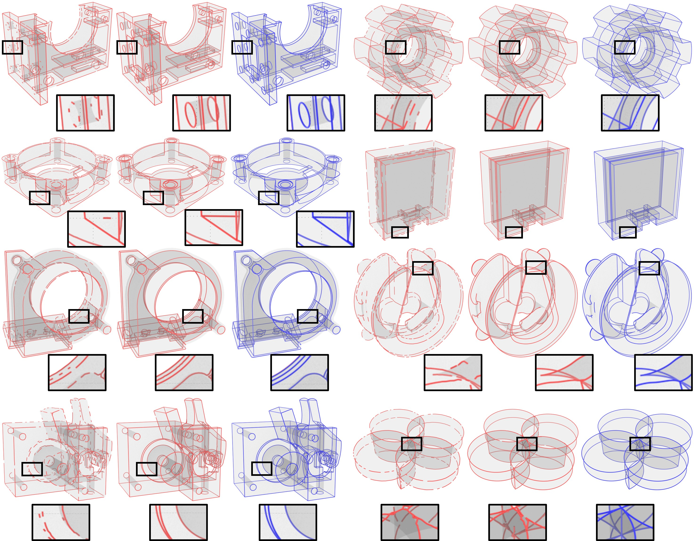
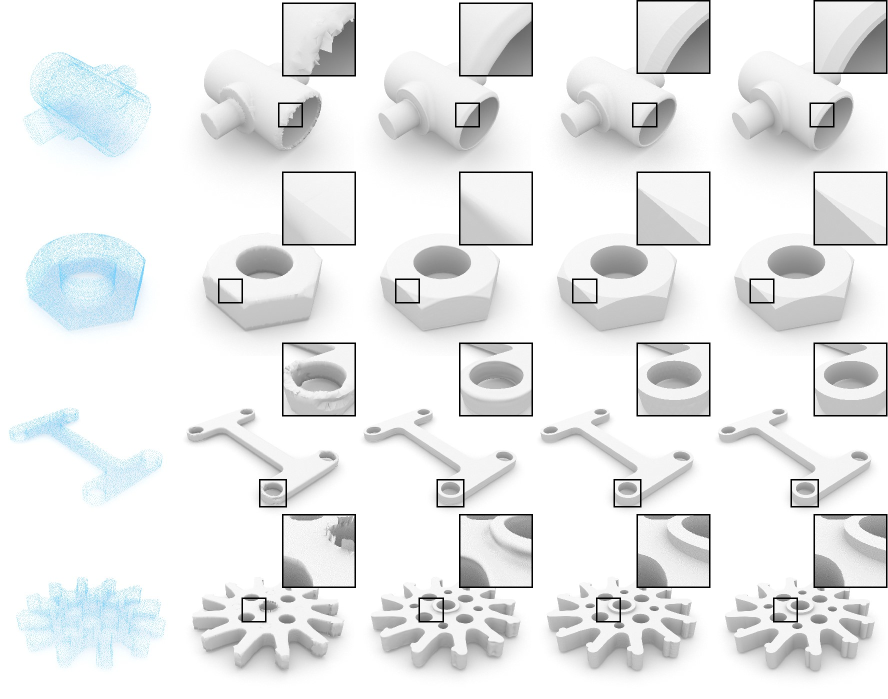

<div align='center'>
<h1>D-FRAME: Direction-Field-Based Wireframe Extraction for CAD Models </h1>
</div>

<!-- <br> -->
Yuan Feng, Honghao Dai, [Guangshun Wei](https://gsw-d.github.io/gswei.github.io/), Long Ma, Pengfei Wang,
Yuanfeng Zhou and Ying He.

This repository contains the brief introduction of PyTorch implementation of D-FRAME. More details of the code, model, 
and datasets will be made publicly available upon publication. 

[//]: # ([[**arXiv**]]&#40;https://arxiv.org/abs/2411.19036&#41; [[**Project page**]]&#40;https://gsw-d.github.io/PCDreamer/&#41;)

<!-- <br> -->



## Abstract

> Extracting wireframes from CAD models represented by point cloud remains a significant challenge in computer graphics. 
> This difficulty arises from two main factors: first, imperfections in the point cloud data, such as lack of orientation, 
> noise, and sparsity; and second, the inherent complexity of geometric shapes, which often feature a high density of 
> sharp edges in close proximity. In this paper, we propose D-FRAME, a multi-stage wireframe extraction framework that 
> incorporates a novel direction field to improve edge detection quality and connectivity, a refinement strategy to address 
> sparse or noisy edge points, and a final \reviminor{coarse-to-fine} connection module to extract a robust wireframe. 
> The direction field not only facilitates connectivity but also enhances the precision of extracted edges by mitigating 
> the impact of misclassified points. By combining the restricted power diagram (RPD) with the extracted wireframes and 
> the original point cloud, our approach also achieves highly faithful reconstruction of CAD model. Experiments conducted 
> on synthetic and real-world scanned CAD datasets demonstrate that D-FRAME effectively manages noise, sparsity, 
> and complex geometries, yielding high-fidelity wireframes.

## Visual results
### Edge Point Classification


### Wireframe Extraction


### CAD Model Reconstruction



[//]: # (## 🔥News)

[//]: # (- **[2025-03-xx]** Code and pre-trained weights released!)

[//]: # (## Pretrained Models)

[//]: # (We provide pretrained PCDreamer models on PCN and ShapeNet-55 [here]&#40;&#41;, download and put it into the ``./checkpoints`` )

[//]: # (folder. )


## Get Started

### Requirements
Our models have been tested on the configuration below:
- python == 3.8.20
- PyTorch == 2.0.1
- CUDA == 11.8
- numpy == 1.24.3
- open3d ==  0.18.0

Install requirements of [Pointcept](https://github.com/Pointcept/Pointcept/tree/main) and pytorch extensions.
```
cd ./libs/pointops
python setup.py install
cd ../..
```

### Brief Introduction
We provide several demos shown in the second figure.
- configs: ``./configs``
- data: ``./data/nerve``
- network: ``'./pointcept/models/default.py'``
- results: ``./exp/nerve(_v5)/semseg-pt-v3m1-0-base/result``(nerve / nerve_v5: classification / direction field prediction)
- curves: ``./exp/curve``

[//]: # (### Inference)

[//]: # (We have provided examples from PCN and ShapeNet55 in the folder ``./demo_pcn`` and ``./demo_55``, respectively.)

[//]: # (Each model includes multi-view depth images available in both PFM format &#40;normalized&#41; and the corresponding PNG format for presentation.)

[//]: # ()
[//]: # (Note: To demonstrate PCDreamer's ability to handle general partial point clouds, the provided partial point clouds from ShapeNet55 )

[//]: # (are generated by selecting a fixed viewpoint and removing 75% of the nearest points from the complete shapes &#40;similar to the conventional hard setting&#41;.)

[//]: # (```)

[//]: # (__C.CONST.WEIGHTS = "path to your checkpoint")

[//]: # ()
[//]: # (# The results should be generated in the folder './infer_res/')

[//]: # (python main_&#40;pcn_w3d/pcn_svd/55_w3d/55_svd&#41;.py --inference --infer_root './demo_&#40;pcn/55&#41;/pts')

[//]: # (```)

[//]: # ()
[//]: # (### Dataset)

[//]: # (1. Download the raw [PCN]&#40;https://gateway.infinitescript.com/s/ShapeNetCompletion&#41; and [ShapeNet55/34]&#40;https://github.com/yuxumin/PoinTr&#41; datasets.)

[//]: # (2. Follow the instructions provided [here]&#40;https://github.com/wentaoyuan/pcn/tree/master/render&#41; to generate partial point clouds from a fixed viewpoint.)

[//]: # (3. Multi-view images and corresponding depth images can be generated by any latest large generation models and depth estimation network.)

[//]: # (4. For training and evaluation, specify the data path in config_*.py &#40;pcn/55&#41; and implement your custom DataLoader )

[//]: # (in ``./utils/data_loaders.py`` to align with your directory structure.)

[//]: # (```)

[//]: # (# Specify the checkpoint path in config_*.py)

[//]: # (# PCN)

[//]: # (__C.DATASETS.SHAPENET.PARTIAL_POINTS_PATH        = '/path/to/PCN_partial/%s/partial/%s/%s/%02d.pcd')

[//]: # (__C.DATASETS.SHAPENET.COMPLETE_POINTS_PATH       = '/path/to/PCN/%s/complete/%s/%s.pcd')

[//]: # (__C.DATASETS.SHAPENET.VIEW_PATH                  = '/path/to/PCN_imgs/%s/%s/')

[//]: # ()
[//]: # (# ShapeNet-55)

[//]: # (__C.DATASETS.SHAPENET55.COMPLETE_POINTS_PATH     = '/path/to/shapenet_pc/%s')

[//]: # (__C.DATASETS.SHAPENET.VIEW_PATH                  = '/path/to/ShapeNet_imgs/%s/%s/')

[//]: # ()
[//]: # (# Switch to ShapeNet-34 Seen/Unseen)

[//]: # (__C.DATASETS.SHAPENET55.CATEGORY_FILE_PATH       = '/path/to/datasets/ShapeNet34&#40;ShapeNet-Unseen21&#41;')

[//]: # (```)

[//]: # ()
[//]: # (### Evaluation)

[//]: # (```)

[//]: # (# Specify the checkpoint path in config_*.py)

[//]: # (__C.CONST.WEIGHTS = "path to your checkpoint")

[//]: # ()
[//]: # (python main_*.py --test &#40;pcn_w3d/pcn_svd/55_w3d/55_svd&#41;)

[//]: # (```)

[//]: # ()
[//]: # (### Training)

[//]: # (```)

[//]: # (python main_*.py &#40;pcn_w3d/pcn_svd/55_w3d/55_svd&#41; )

[//]: # (```)
## Acknowledgement
The repository is based on [Pointcept](https://github.com/Pointcept/Pointcept/tree/main), [Point Transformer
V3](https://github.com/Pointcept/PointTransformerV3) and
[NerVE](https://github.com/uhzoaix/NerVE).

We thank the authors for their excellent works！

[//]: # (## Citation)

[//]: # (```)

[//]: # (@article{wei2024pcdreamerpointcloudcompletion,)

[//]: # (      title={PCDreamer: Point Cloud Completion Through Multi-view Diffusion Priors},)

[//]: # (      author={Guangshun Wei, Yuan Feng, Long Ma, Chen Wang, Yuanfeng Zhou, Changjian Li},)

[//]: # (      year={2025},)

[//]: # (      journal={CVPR},)

[//]: # (})

[//]: # (```)


