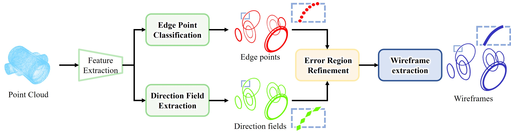
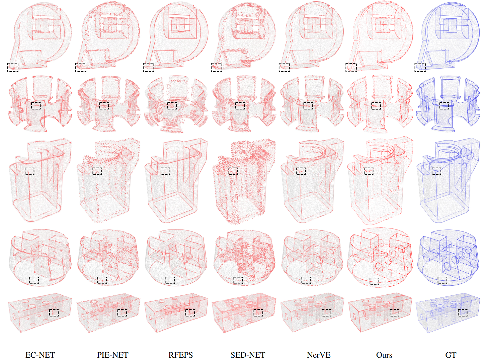
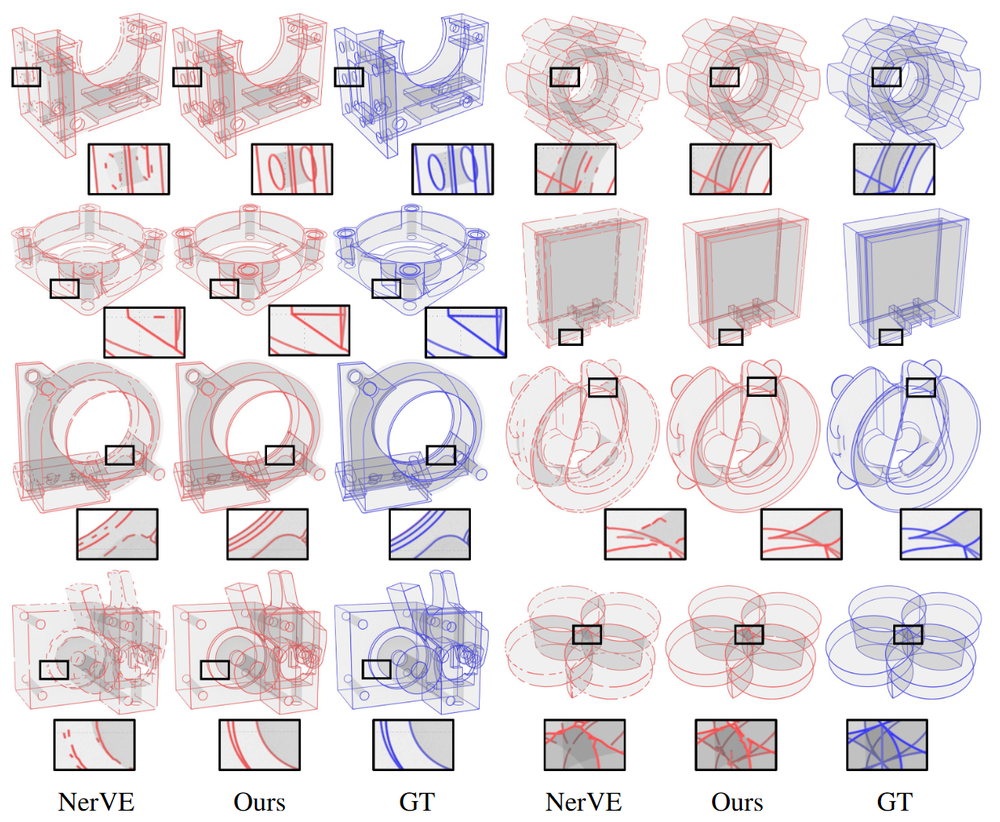
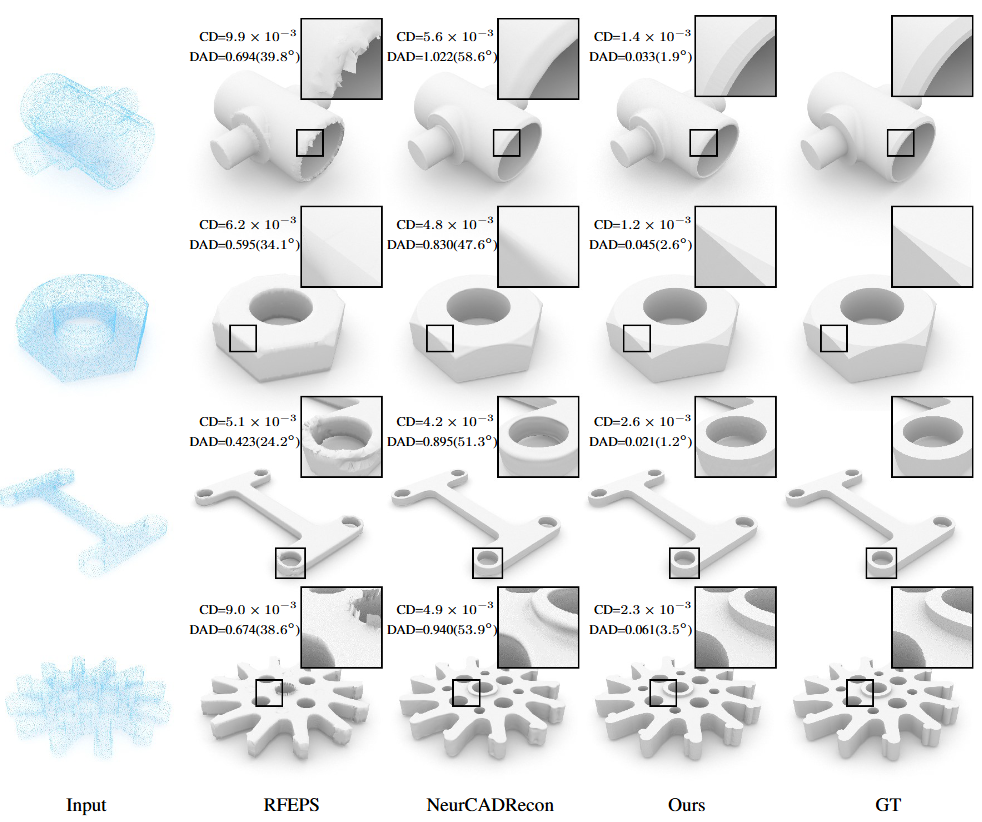

<div align='center'>
<h1>D-FRAME: Direction-Field-Based Wireframe Extraction for CAD Models </h1>
</div>

<!-- <br> -->
Yuan Feng, Honghao Dai, [Guangshun Wei](https://gsw-d.github.io/gswei.github.io/), Long Ma, Pengfei Wang,
Yuanfeng Zhou and Ying He.

This repository contains the brief introduction of PyTorch implementation of D-FRAME. More details of the code, model, 
and datasets will be made publicly available upon publication. 


<!-- <br> -->



## Abstract

> Extracting wireframes from CAD models represented by point cloud remains a significant challenge in computer graphics. 
> This difficulty arises from two main factors: first, imperfections in the point cloud data, such as lack of orientation, 
> noise, and sparsity; and second, the inherent complexity of geometric shapes, which often feature a high density of 
> sharp edges in close proximity. In this paper, we propose D-FRAME, a multi-stage wireframe extraction framework that 
> incorporates a novel direction field to improve edge detection quality and connectivity, a refinement strategy to address 
> sparse or noisy edge points, and a final \reviminor{coarse-to-fine} connection module to extract a robust wireframe. 
> The direction field not only facilitates connectivity but also enhances the precision of extracted edges by mitigating 
> the impact of misclassified points. By combining the restricted power diagram (RPD) with the extracted wireframes and 
> the original point cloud, our approach also achieves highly faithful reconstruction of CAD model. Experiments conducted 
> on synthetic and real-world scanned CAD datasets demonstrate that D-FRAME effectively manages noise, sparsity, 
> and complex geometries, yielding high-fidelity wireframes.

## Visual results
### Edge Point Classification


### Wireframe Extraction


### CAD Model Reconstruction



[//]: # (## 🔥News)

[//]: # (- **[2025-03-xx]** Code and pre-trained weights released!)

[//]: # (## Pretrained Models)

[//]: # (We provide pretrained PCDreamer models on PCN and ShapeNet-55 [here]&#40;&#41;, download and put it into the ``./checkpoints`` )

[//]: # (folder. )


## Get Started

### Requirements
Our models have been tested on the configuration below:
- python == 3.8.20
- PyTorch == 2.0.1
- CUDA == 11.8
- numpy == 1.24.3
- open3d ==  0.18.0

Install requirements of [Pointcept](https://github.com/Pointcept/Pointcept/tree/main) and pytorch extensions.
```
cd ./libs/pointops
python setup.py install
cd ../..
```

### Brief Introduction
We provide several demos shown in the second figure.
- configs: ``./configs``
- data: ``./data/nerve``
- dataset: ``./pointcept/datasets/nerve.py``
- network: ``'./pointcept/models/default.py'``
- results: ``./exp/nerve(_v5)/semseg-pt-v3m1-0-base/result``(nerve / nerve_v5: classification / direction field prediction)
- curves: ``./exp/curve``

### Training
```
sh scripts/train.sh -p ${INTERPRETER_PATH} -g ${NUM_GPU} -d ${DATASET_NAME} -c ${CONFIG_NAME} -n ${EXP_NAME} -r true
# For example：
sh scripts/train.sh -g 4 -d nerve(_v5) -c semseg-pt-v3m1-0-base -n semseg-pt-v3m1-0-base
```

### Testing
```
sh scripts/test.sh -p ${INTERPRETER_PATH} -g ${NUM_GPU} -d ${DATASET_NAME} -n ${EXP_NAME} -w ${CHECKPOINT_NAME}
# For example：
sh scripts/test.sh -g 2 -d nerve(_v5) -c semseg-pt-v3m1-0-base -n semseg-pt-v1-0-base_v2
```


## Acknowledgement
The repository is based on [Pointcept](https://github.com/Pointcept/Pointcept/tree/main), [Point Transformer
V3](https://github.com/Pointcept/PointTransformerV3) and
[NerVE](https://github.com/uhzoaix/NerVE).

We thank the authors for their excellent works！


